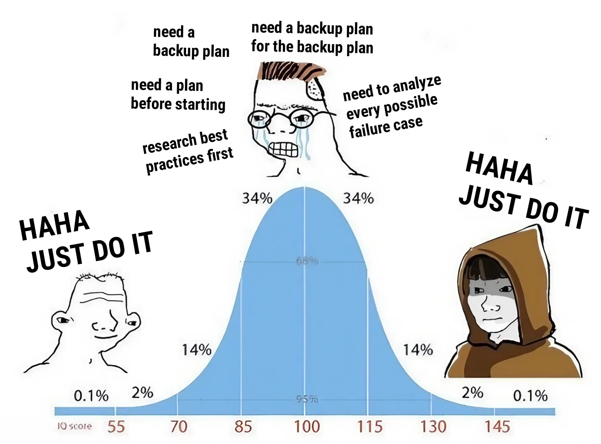
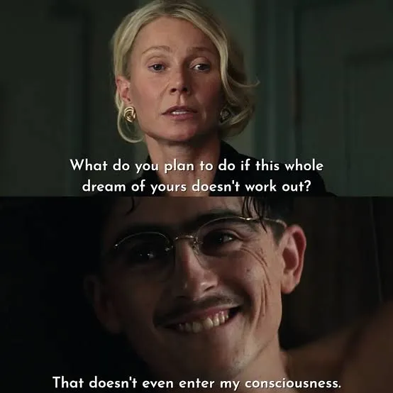
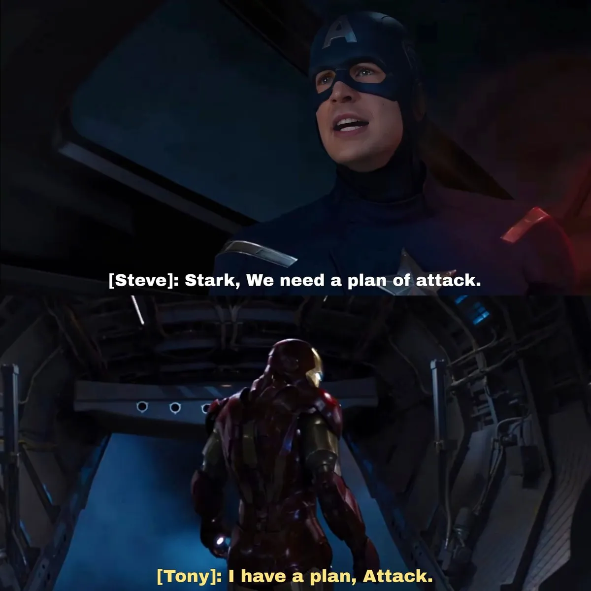

Your delusion and audacity will take you to places where your logic couldn't, STOP BEING REALISTIC.

Be dumb, world is ruled by movers not philosophers. Stop trying to over-analyze things more than what's necessary and start moving. 

If you need an apple from the tree, don't analyze the height of the tree or analyze if the apple is sweet enough for that trouble or create climbing algorithms, steps to take, things to watch out for, DOs, DONTs. Just climb the damn tree and grab that apple. 

Most of the time it really is as easy as that — climbing that damn tree and snatching that damn apple. What complicates it is our analysis and inner debates over all the pros and cons of doing so.

There are 2 types of guys who want to open a YouTube channel. One will study content creation, thumbnail designing, trend analysis, spend nights crossing and filtering out niches to choose, will read all success stories and failure stories (which could single-handedly make him give-up on a dream which he never started). Even if he survives from failure stories, he could also generate a list of execuses and save those execuses in a file and name it "reality check" — "this is a dead niche in 2026" or "that niche has a lower RPM and not worth it", "that is a good niche but i need a good setup to look good in the video". This tiring process will squeeze the life and time out of that guy. Some months later he has forgotten about that dream he had and is lying on the bed with no self-progress, scrolling. Then he discovers a guy making it out there on YouTube in the same niche he crossed out saying "impractical" with no setup and no preparation. The reason we didn't discuss about that other guy in the whole story up until now is because he didnt have much to be said about. He had a straight, dumb story that goes like "i want to start a youtube channel" — \*starts a youtube channel\*.

This is the whole crux of making it through.

> Do not suffer BEFORE it's necessary.

Do not think much about it, do not wait for a perfect opportunity, just move like you have no brain to process what could go wrong.

This whole process of analysing before acting gives us a rabbit hole - a sense of comfort, an illusion of being productive. Studying about how to apply to a job, how to draft the world's best cold email, how to crack that exam, gives us an illusion that we are working towards our goal. But studying about how to do it, telling people that you're gonna do it, IS NOT DOING IT. 

You fear that if you jumped into it without being 100% sure then you'd look dumb. But that's just what is necessary - to be dumb. Dumb guys don't care about if they're looking dumb or not while trying to do the impossible or taking bold steps. All those who made it big in life and got listed in the hall of fame, they all didn't succeed because they did it smartly, they all succeeded because they just did it. 

This doesn't imply that those who over-analyze are always a looser or those who dont are winners. It's that dumb people have more chances of winning than those who have too much brains. With trying to do it smartly and efficiently, all you can achieve is just average at best but if you want to achieve greatness? you have to start messy, you have to fail multiple times and most important of them all - YOU HAVE TO BE A LITTLE GONE FROM UP THERE.

When someone achieves what was thought to be unachievable, you often find people saying, "oh he had good timing", "lucky shot", "she just got lucky" - LUCK is not a concept, its not some abstract force, its a skill. Something you can develop. Yes it is possible. Luck is just a dart thrown at a dartboard you build yourself. That dartboard is made up of every attempt you take toward your dream. The more attempts you make, the larger the board becomes, and the larger the board, the easier it is for the dart to find its mark. 

That's why "Luck Favors The Bold". If you hesitate to act, luck has nothing to work with. Even if the universe were on your side, what could it possibly do for you if you never take the shot? 

You look at your goals and then read this and you say "huh... easier said than done" but that's the thing, you see, if it was easy? we wouldn't be talking about it in the first place. You have to be too dumb to see the implausibility of the goal.

The difference between a dumb and an "intelligent" guy is that they both see the height of the cliff - DIFFERENTLY. You can't convince a dumb person that the cliff is really far away. They're dumb, they don't know "number + kilometers", all they know is to just march. LEFT, RIGHT, GOODNIGHT.

The average life span of modern man is around 70 years. This is such a short number for the possibilities you hold inside yourself. Do not aim for a smooth, error free path to success. You will fail multiple times before you make it. So fail faster.
